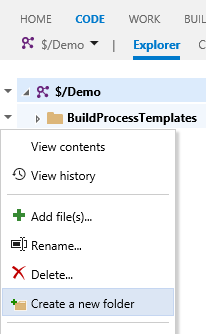

> **NOTE** - We have deprecated support for Visual Studio Team Services (VSTS) and Team Foundation Server 2018, or higher. The *create new folder* feature is now part of the product for VSTS and TFS 2018, or higher. 
> See [Deprecating our Folder Management extension](https://blogs.msdn.microsoft.com/visualstudioalmrangers/2017/08/31/deprecating-our-folder-management-extension/) for details.

## Create folders without cloning ##

In Visual Studio Team Services you can add, edit, and delete files right from the web. However, if you need to add files or move existing files to a new folder, you must clone (or check out) the source repository locally, make the change, and commit it back to the server. With this extension you can now quickly create a folder right from the web. This is especially useful for non-developers used to working in the web.

Works with both Git and Team Foundation Version Control source repositories.

## Quick steps to get started ##

1. From the Code hub, select a folder to create the new folder under.
1. Right-click and select **Create a new folder**.
1. Specify a folder name and an optional checkin comment. Click on **Create**.
1. The new folder is created.
1. (Git only) A placeholder file is added.

You can create nested folders by using `/`. For example, `MyNewFolder/MyNestedFolder`, creates the placeholder file in the MyNestedFolder folder.

> As empty folders are not allowed with Git, a file called _placeholder.md is added as part of the folder creation. 

## Learn more ##

The [source](https://github.com/ALM-Rangers/Folder-Management-Extension) to this extension is available. Feel free to take, fork, and extend.

> Microsoft DevLabs is an outlet for experiments from Microsoft, experiments that represent some of the latest ideas around developer tools. Solutions in this category are designed for broad usage, and you are encouraged to use and provide feedback on them; however, these extensions are not supported nor are any commitments made as to their longevity.

## Contributors

We thank the following contributor(s) for this extension: Abel Wang and Wouter de Kort. 

## Feedback

We need your feedback! Here are some ways to connect with us:

- Add a review below.
- Send us an [email](mailto://mktdevlabs@microsoft.com).

Review the [list of features and resolved issues of latest tools and extensions](https://aka.ms/vsarreleases) for information on the latest releases.
